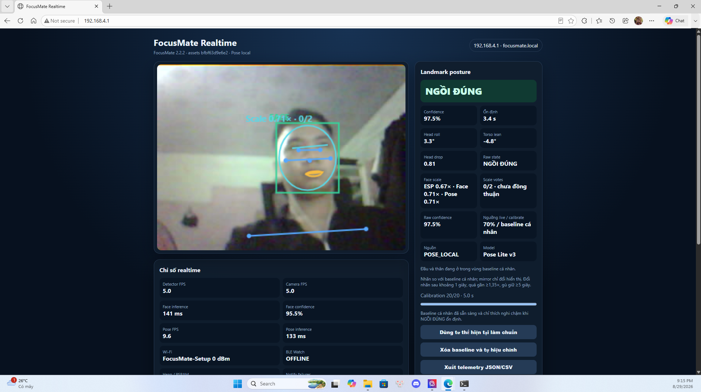
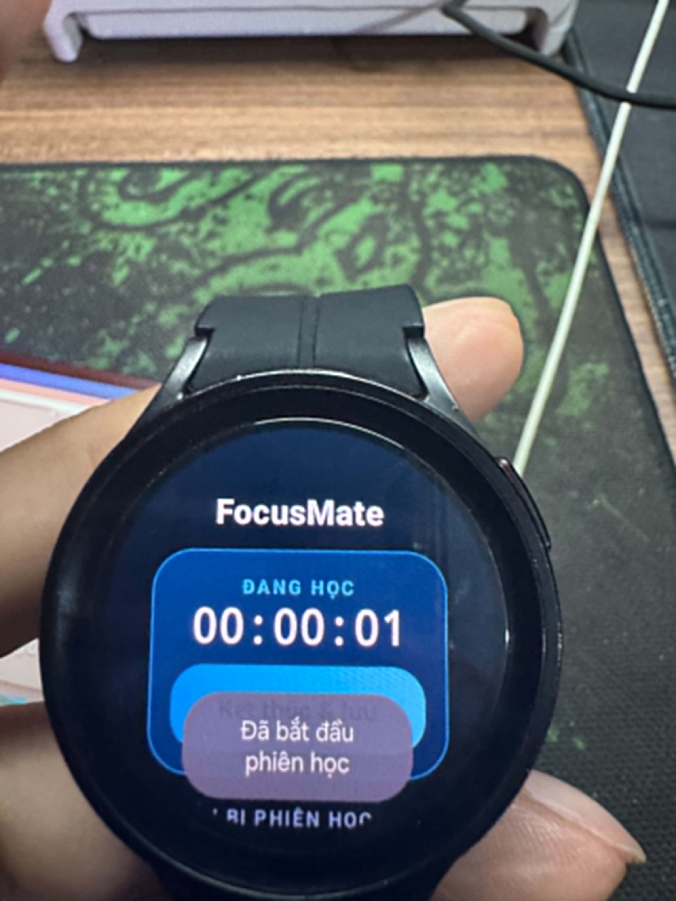
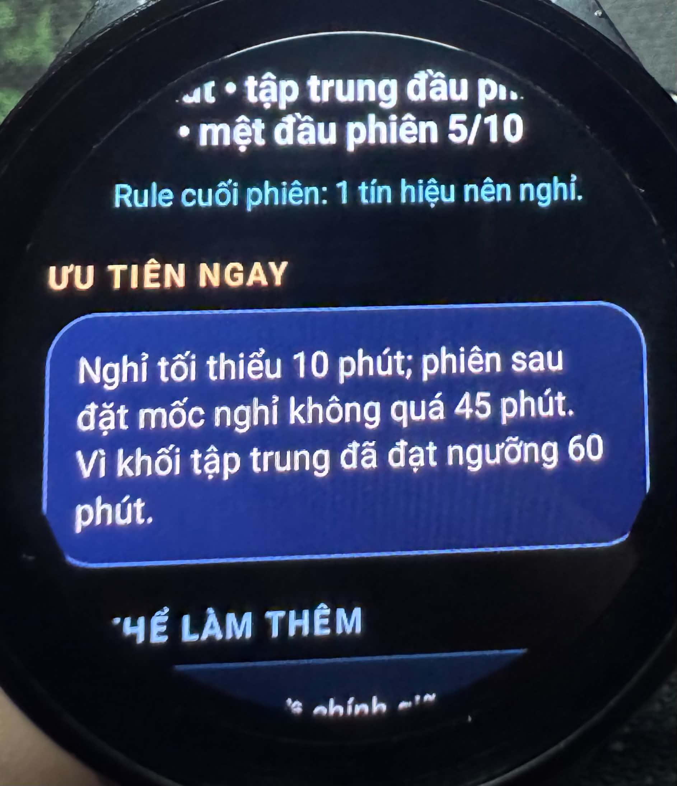

<p align="center">
  
</p>

<h1 align="center">FocusMate</h1>

<p align="center"><strong>A local-first focus coach for WearOS and ESP32-S3.</strong></p>
<p align="center">Theo dõi tư thế, ngáp và nhắc nghỉ — xử lý hoàn toàn trên thiết bị nhỏ gọn</p>

<p align="center">
  <a href="tests/FocusMate_Test/Evidence/TC24_KetThucPhienDongHo.mp4"><strong>Watch demo video</strong></a>
  &nbsp;·&nbsp;
  <a href="docs/DEMO.md"><strong>Demo script</strong></a>
  &nbsp;·&nbsp;
  <a href="https://github.com/vietdo1201/FocusMate/releases/latest"><strong>Download release</strong></a>
  &nbsp;·&nbsp;
  <a href="#how-it-works"><strong>How it works</strong></a>
</p>

<p align="center">
  <a href="https://github.com/vietdo1201/FocusMate/actions/workflows/verify.yml"></a>
  <a href="tests/FocusMate_Test/TEST_MATRIX.md"></a>
  <a href="LICENSE"></a>
  <a href="REUSE.toml"></a>
</p>

<table align="center">
  <tr>
    <td align="center" width="33%"><strong>100% local</strong><br><sub>No camera or health<br>cloud upload</sub></td>
    <td align="center" width="34%"><strong>Wear OS + ESP32</strong><br><sub>Real cross-device<br>prototype</sub></td>
    <td align="center" width="33%"><strong>Reproducible</strong><br><sub>Pinned models, SBOM<br>and tests</sub></td>
  </tr>
</table>

## Giới thiệu

FocusMate là trợ lý học tập mã nguồn mở giúp theo dõi phiên học, nhận biết dấu
hiệu tư thế chưa phù hợp hoặc ngáp và nhắc người dùng nghỉ đúng lúc. Hệ thống
được thiết kế theo hướng local-first: frame camera, dữ liệu cảm biến và kết quả
phân tích không được tải lên dịch vụ cloud.

ESP32-S3 kết nối camera OV2640, chạy detector và phục vụ dashboard trong mạng
cục bộ. Galaxy Watch quản lý phiên học, thu nhận motion/nhịp tim và chạy các
model hỗ trợ trên thiết bị; dashboard hiển thị camera, trạng thái và thông tin
chẩn đoán kỹ thuật từ ESP.

Posture và yawn chỉ là **tín hiệu tư vấn** và có thể sai trong điều kiện góc quay,
che khuất hoặc ánh sáng không phù hợp. Quyết định nhắc nghỉ thuộc về Rule Engine
v2 deterministic trên Watch, tách biệt với các model inference. FocusMate không
phải thiết bị y tế và không dùng để chẩn đoán sức khỏe.

## Hình ảnh và demo

### Dashboard camera và trạng thái tư thế

<a href="tests/FocusMate_Test/Evidence/TC05_camera_web.png">
  
</a>

*Dashboard được phục vụ từ ESP32-S3 trong mạng local; nhấp ảnh để mở bản đầy đủ.*

### Phiên học trên Galaxy Watch

<a href="tests/FocusMate_Test/Evidence/TC24_StartDH.jpg">
  
</a>

*Phiên học đang chạy trên thiết bị thật; ảnh giữ nguyên tỷ lệ gốc.*

### Gợi ý cuối phiên

<a href="tests/FocusMate_Test/Evidence/TC19_summary_suggestion.jpg">
  
</a>

*Báo cáo cuối phiên trình bày hành động được Rule Engine và Session Advice tổng hợp.*

- [Video dashboard và luồng AI trên Web](tests/FocusMate_Test/Evidence/test_demo_web.mp4)
- [Video kết thúc phiên và mở báo cáo trên Watch](tests/FocusMate_Test/Evidence/TC24_KetThucPhienDongHo.mp4)
- [Kịch bản trình diễn có chú thích phạm vi](docs/DEMO.md)

Video evidence được quản lý bằng Git LFS. Sau khi clone, chạy `git lfs pull` nếu
trình xem chỉ nhận được tệp pointer. Video kết thúc phiên ở trên chỉ ghi lại bước
kết thúc và báo cáo trên Watch, không phải bản demo toàn hệ thống.

## Tính năng

| Tính năng | Giá trị mang lại |
|---|---|
| Quản lý phiên học | Bắt đầu, theo dõi và kết thúc phiên ngay trên Watch, kể cả khi kết nối local tạm thời gián đoạn. |
| Tư vấn tư thế | Pose Landmarker và detector local giúp nhận biết các trạng thái tư thế cần người dùng tự kiểm tra lại. |
| Nhận biết ngáp | Face Landmarker theo dõi tín hiệu ngáp theo thời gian mà không gửi frame ra cloud. |
| Nhắc nghỉ | Rule Engine v2 deterministic quản lý thời điểm, lý do và cooldown của lời nhắc nghỉ. |
| Báo cáo cuối phiên | Session Advice tổng hợp tối đa ba hành động cùng bằng chứng từ dữ liệu của phiên. |
| Dashboard cục bộ | Trình duyệt hiển thị camera, trạng thái và số liệu vận hành trực tiếp từ ESP32-S3. |
| Hoạt động offline | Model và runtime được khóa phiên bản, kiểm tra SHA-256 và đóng gói khi build để inference không tải CDN lúc chạy. |

Các tần suất BLE, ngưỡng, debounce và classifier state chi tiết được mô tả trong
[tài liệu AI](docs/AI.md), [GATT profile](docs/GATT_PROFILE.md) và
[Local Frame V1](docs/LOCAL_FRAME_V1.md).

## How it works

| Thành phần | Vai trò |
|---|---|
| ESP32-S3 + OV2640 | Thu frame, chạy face detector, phát metadata qua BLE và phục vụ dashboard/frame tạm thời trong mạng local. |
| Galaxy Watch | Quản lý phiên, cảm biến, inference posture/yawn, Rule Engine và báo cáo cuối phiên. |
| Web dashboard | Hiển thị camera/trạng thái và chạy inference Web từ runtime/model đã đóng gói trong firmware. |

```text
OV2640 → ESP32-S3 ──→ Web dashboard local → posture/yawn advisory
             │
             ├─ BLE GATT mã hóa: bbox, trạng thái và capability
             └─ HTTP local có token: frame tạm thời → Galaxy Watch inference

Watch motion/HR + trạng thái phiên ──→ Rule Engine v2 ──→ nhắc nghỉ
Watch posture/yawn advisory ────────────────────────────→ UI và báo cáo
```

Hai đường cuối được tách riêng có chủ ý: posture/yawn không trực tiếp kích hoạt
hoặc thay đổi quyết định nhắc nghỉ của `watch_rules_v2`. Frame local chỉ tồn tại
tạm thời trong RAM; BLE được bond/mã hóa, còn HTTP local dùng token theo từng
lần boot và không được mô tả như TLS.

## Bắt đầu sử dụng

### Bản dựng sẵn

1. Tải artifact và checksum từ [FocusMate v2.2.2](https://github.com/vietdo1201/FocusMate/releases/tag/v2.2.2)
   hoặc trang [latest release](https://github.com/vietdo1201/FocusMate/releases/latest).
2. Cài APK lên Watch theo [hướng dẫn phát hành và ADB](RELEASE.md).
3. Chọn đúng image và board theo [hướng dẫn flash ESP32-S3](docs/FLASHING_v2.2.2.md).

Để cập nhật thông thường, dùng riêng image `update-app` và `update-assets`; hai
phân vùng này không ghi NVS. Image `factory-full` chỉ dành cho cài mới hoặc phục
hồi toàn bộ và có thể thay thế NVS, Wi-Fi cùng baseline. Không dùng
`factory-full` làm lựa chọn cập nhật mặc định.

### Build từ mã nguồn

Yêu cầu: Python 3.11+, Node.js 20+, JDK 17, Android SDK có platform API 35 và
ESP-IDF 5.5.5. APK hiện đóng ABI `armeabi-v7a`; thiết bị được ghi nhận là Galaxy
Watch 5 Pro SM-R925F, không phải tuyên bố tương thích với mọi Watch hoặc ABI.

Windows PowerShell:

```powershell
./verify.ps1
```

Linux/macOS sau khi kích hoạt ESP-IDF:

```bash
./verify.sh
```

Hai wrapper đã tự chạy bootstrap model hash-pinned, test contract, Gradle
test/lint/APK và firmware build nên không cần gọi bootstrap lặp lại. Lần chuẩn
bị dependency/artifact cần kết nối mạng; app, firmware và inference không tải
model từ mạng khi runtime. Build debug hoặc release unsigned để kiểm tra source
không cần signing key của tác giả. Xem [BUILDING.md](docs/BUILDING.md) và
[RELEASE.md](RELEASE.md) để build từng thành phần hoặc cấu hình signing riêng.

## Kiểm thử và giới hạn

> **Recorded System Test: 24 / 24 test cases PASS — 100%**
>
> Thiết bị: ESP32-S3 N16R8 + OV2640 + Galaxy Watch 5 Pro + Web Dashboard
>
> Thời gian ghi nhận: 28–29/08/2026
>
> Phân loại: `RECORDED_FUNCTIONAL_TEST`

Bộ test bao phủ boot, Wi-Fi, camera, dashboard, posture/yawn, Watch alert, phiên
học, báo cáo, reconnect và một phiên 61 phút đã ghi nhận.

- [Ma trận 24 test cases và evidence trực tiếp](tests/FocusMate_Test/TEST_MATRIX.md)
- [Toàn bộ ảnh/video bằng chứng](tests/FocusMate_Test/Evidence/)
- [Bảng Excel: expected, actual, severity và ngày test](tests/FocusMate_Test/Excel/FocusMate_24_Test_Cases_Severity.xlsx)
- [Trạng thái implementation và evidence gate](docs/STATUS.md)

CI chứng minh các bước test, lint và build tự động; nó không thay thế kiểm thử
thiết bị thật. Kết quả 24/24 chỉ xác minh các kịch bản đã ghi, không phải tuyên
bố accuracy AI 100%, độ ổn định thermal/soak dài hạn hoặc hiệu quả học tập và
sức khỏe. Byte-exact artifact `v2.2.2` chưa được cài/flash lại tại thời điểm phát
hành; các bài posture đủ tám state, low-light, yawn/speech false-positive và
long-run vẫn còn giới hạn được công bố trong [STATUS.md](docs/STATUS.md).

## Tài liệu

| Nhu cầu | Tài liệu |
|---|---|
| Build và cài đặt | [Build từ nguồn](docs/BUILDING.md) · [Cài Watch/signing](RELEASE.md) · [Flash v2.2.2](docs/FLASHING_v2.2.2.md) |
| AI, dữ liệu và giới hạn | [AI.md](docs/AI.md) · [STATUS.md](docs/STATUS.md) |
| Kiến trúc và protocol | [GATT profile](docs/GATT_PROFILE.md) · [Local Frame V1](docs/LOCAL_FRAME_V1.md) · [Web dashboard](docs/WEB_DASHBOARD.md) · [ADR](docs/decisions/) |
| Kiểm thử và trạng thái | [Test matrix](tests/FocusMate_Test/TEST_MATRIX.md) · [Tổng quan test](tests/README.md) · [Device reports](reports/) |
| Release và thay đổi | [Release notes v2.2.2](docs/RELEASE_NOTES_v2.2.2.md) · [Changelog](CHANGELOG.md) |
| Đóng góp và bảo mật | [Contributing](CONTRIBUTING.md) · [Security](SECURITY.md) · [Issues](https://github.com/vietdo1201/FocusMate/issues) |
| License và dependency | [Third-party notices](THIRD_PARTY_NOTICES.md) · [Licensing policy](docs/LICENSING.md) · [SBOM hiện tại](sbom/focusmate-current.spdx.json) |

## Cấu trúc repository

| Thư mục | Nội dung chính |
|---|---|
| `wear/` | Ứng dụng Wear OS và protocol Kotlin |
| `firmware/` | Firmware ESP-IDF, dashboard và detector |
| `tools/` | Bootstrap, verification và tạo SBOM |
| `docs/` | Hướng dẫn, protocol, ADR và trạng thái |
| `tests/`, `reports/`, `sbom/` | Test/evidence, báo cáo thiết bị và hồ sơ dependency |

## Đóng góp và giấy phép

Đọc [CONTRIBUTING.md](CONTRIBUTING.md) trước khi gửi thay đổi; lỗi và đề xuất có
thể được ghi tại [GitHub Issues](https://github.com/vietdo1201/FocusMate/issues).
Không đưa model binary, ảnh khuôn mặt, dữ liệu người tham gia hoặc signing
material vào commit.

Mã dự án dùng Apache-2.0, ngoại trừ component `focusmate_dns` dùng MIT. Toàn văn
giấy phép nằm trong [`LICENSES/`](LICENSES/). Dependency và model giữ giấy phép
của bên cung cấp, được ghi trong [THIRD_PARTY_NOTICES.md](THIRD_PARTY_NOTICES.md)
và [chính sách licensing](docs/LICENSING.md).

[SBOM lịch sử v2.2.2](sbom/focusmate-v2.2.2.spdx.json) được giữ nguyên; đường
sinh hiện tại tạo [runtime audit](sbom/focusmate-current.spdx.json) riêng.
`NOASSERTION` nghĩa là chưa có đủ nguồn đúng phiên bản để kết luận, không có
nghĩa dependency “không có license” hoặc toàn bộ dự án đã được kiểm toán pháp lý.

## English summary

FocusMate is an open-source, local-first study assistant for a Galaxy Watch and
an ESP32-S3 camera board. The ESP serves camera data and a local dashboard while
the Watch manages study sessions, on-device inference, deterministic break
rules, and end-of-session reports. Posture and yawn outputs are advisory only;
they do not control the break rule engine. Builds use pinned model hashes and
published dependency metadata, and the recorded 24/24 functional test result is
not an AI-accuracy or long-term reliability claim. FocusMate is not a medical
device.
