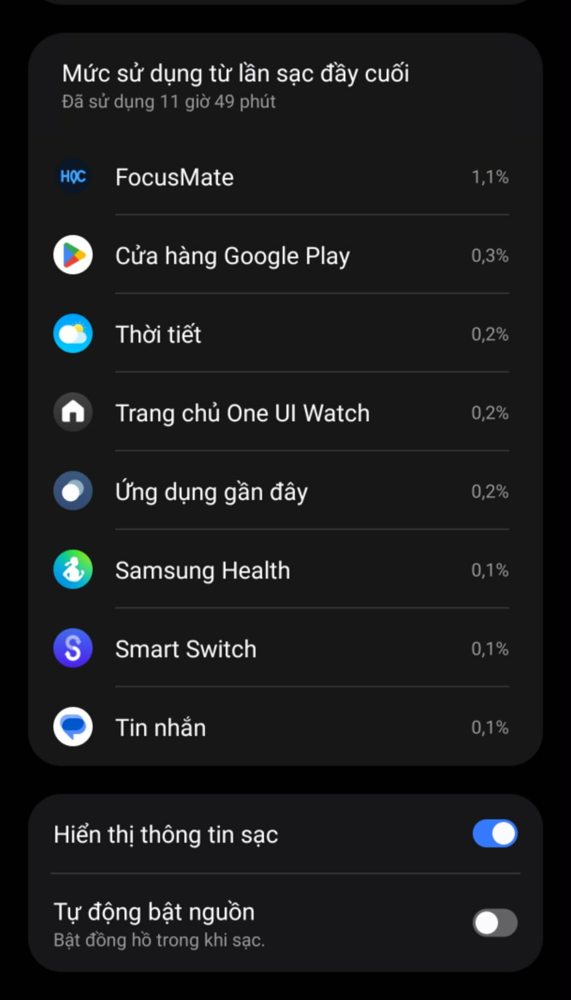

# Quan sát mức dùng pin trên Galaxy Watch 5 Pro — 2026-08-25

Trạng thái bằng chứng: `OBSERVED_DEVICE / SUPPORTING_EVIDENCE`.

Ảnh dưới đây là số liệu do giao diện pin của One UI Watch ghi nhận trên Galaxy Watch 5 Pro sau **11 giờ 49 phút kể từ lần sạc đầy gần nhất**. FocusMate được hệ thống quy **1,1%** mức sử dụng pin trong cửa sổ này.



## Bối cảnh

| Trường | Giá trị |
|---|---|
| Thiết bị Watch | Samsung Galaxy Watch 5 Pro (`SM-R925F`) |
| Wear OS/API | Wear OS; API/build không hiển thị trong ảnh nên `NOT_RECORDED` |
| App build | `1.21-yawn-ble-v2`, `versionCode 22` (xác nhận qua ADB trước khi chụp) |
| Protocol | Yawn event/state V2 qua GATT hiện hữu; ảnh này không kiểm chứng protocol |
| Firmware/board | ESP32-S3; firmware build và trạng thái kết nối không hiển thị trong ảnh nên `NOT_RECORDED` |
| Cửa sổ One UI Watch | 11 giờ 49 phút kể từ lần sạc đầy gần nhất |
| Kết quả FocusMate | 1,1% |

Các cơ chế tiết kiệm pin có trong app build được quan sát:

- Chính sách kết nối: BLE 5 Hz khi màn hình bật, 2 Hz khi màn hình tắt và heartbeat 1 Hz khi nhiệt nghiêm trọng.
- Đồng bộ số lần ngáp dùng BLE; HTTP frame có backoff `1–2–4–8–16–30 giây` khi mất đường local.
- Cảm biến chuyển động giữ nguyên tần số lấy mẫu nhưng gom lần giao dữ liệu theo lô 2 giây.
- SHA-256 ảnh gốc: `1C5029065197E50F28A133518701CD92EB6F77323BAFE7F6679E0758864EC26E`.

## Kiểm tra và kết quả

```powershell
adb -s <watch> shell "dumpsys package vn.edu.uit.tpkd.wear.cogload | grep -E 'versionName|versionCode'"
# PASS: versionCode=22, versionName=1.21-yawn-ble-v2

Get-FileHash -Algorithm SHA256 reports/assets/2026-08-25-galaxy-watch5-pro-battery-usage.png
# PASS: 1C5029065197E50F28A133518701CD92EB6F77323BAFE7F6679E0758864EC26E
```

| Hạng mục | Trạng thái |
|---|---|
| Ảnh One UI Watch trên thiết bị thật | `PASS / OBSERVED_DEVICE` |
| App build được xác nhận | `PASS` |
| Benchmark đối chứng trước–sau | `NOT_RUN` |
| Mục tiêu giảm ít nhất 10% trong soak | `NOT_RUN` |

## Kết luận được phép rút ra

Ảnh là bằng chứng thiết bị thật cho thấy One UI Watch ghi nhận FocusMate ở mức **1,1%** trong cửa sổ quan sát nêu trên. Nó hỗ trợ nhận định rằng ứng dụng không phải nguồn tiêu thụ pin chính trong cửa sổ đó.

## Giới hạn

Đây **không phải benchmark trước–sau** và không tự chứng minh mức tiết kiệm tối thiểu 10%. Con số 11 giờ 49 phút là thời gian sử dụng thiết bị kể từ lần sạc đầy, không phải thời gian FocusMate hoạt động liên tục. Giao diện không cho biết thời lượng phiên học, thời gian màn hình bật, nhiệt độ, chất lượng sóng hoặc tỷ lệ hao pin toàn thiết bị. Để khẳng định mức cải thiện, cần chạy hai bài soak cùng điều kiện trên cùng Watch và so sánh mức tụt pin theo giờ.
